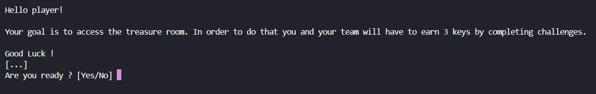
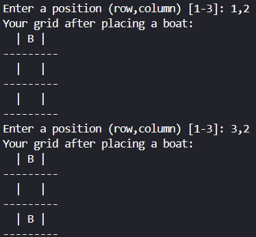

# 🏰 Fort Boyard Simulator

## 📋 General Presentation

### 📌 Project Title
Fort Boyard Simulator: Overcome Obstacles and Unlock the Treasure

### 👥 Contributors
- **Samy Gharnaout**
- **Romain Khonke**

### 📜 Description
A Python-based game inspired by the famous TV show Fort Boyard. The goal is to lead a team of players through various challenges to collect keys and unlock the treasure room.

### ✨ Key Features
- Create a team of up to 3 players.
- Participate in four types of challenges:
  - 🧮 Mathematics
  - 🎲 Chance
  - 🧩 Logic
  - 🤔 Père Fouras' Riddles
- Save performance history for replayability and improvement (bonus).
- Unlock the treasure room by deciphering clues!

### 🛠️ Technologies Used
- **Python**: Core programming language
- **JSON**: Data management for riddles and clues
- **Git/GitHub**: Version control and collaboration

### 🚀 Installation
1. Clone the repository:
   ```bash
   git clone https://github.com/username/pyfort-yourname-group.git
   cd pyfort-yourname-group
   ```
2. Set up the environment:
   - Install Python 3.8+ if not already installed.
   - Install required libraries (if any, e.g., `pip install -r requirements.txt`).

### 🎮 How to Use
1. Run the main program:
   ```bash
   python main.py
   ```
2. Follow the on-screen instructions to play the game:
   - Compose your team.
   - Select challenges and play.
   - Collect keys to access the treasure room.
3. Review results in the output history (bonus feature).

---

## 📂 Python Files Overview

### `main.py`
The main entry point of the game. This file coordinates all the game actions, such as initializing the team, managing challenges, and handling the final treasure room stage.

### `math_challenges.py`
Contains various math-based challenges, like factorial calculations and solving equations. These challenges test players' mathematical skills in fun and engaging ways.

### `chance_challenges.py`
Implements games of chance, such as dice rolls and shell games. These challenges rely on randomness and luck to win keys.

### `logical_challenges.py`
Houses logic-based games, such as Nim and Tic-Tac-Toe. These games are designed to test players' strategic and problem-solving abilities.

### `pere_fouras_challenge.py`
Focuses on Père Fouras' riddles. Players must solve riddles to win keys, with data sourced from a JSON file containing various riddles.

### `final_challenge.py`
Handles the treasure room challenge, where players decode clues to guess the code word and unlock the treasure. This is the climactic stage of the game.

### `utility_functions.py`
Provides utility functions for game management, including team creation, player selection, and challenge navigation. These functions support seamless gameplay.

---

## 📖 Technical Documentation

### 🧩 Game Algorithm
1. **Introduction**: Display game rules.
2. **Team Creation**: Compose a team of players with unique roles.
3. **Event Loop**: Cycle through challenges until three keys are won:
   - Select a challenge type.
   - Choose a player to participate.
   - Attempt to win the challenge.
4. **Final Stage**: Decode clues to unlock the treasure room.
5. **Endgame**: Display results and exit.

### 🔧 Functions
#### Example Prototypes:
- `compose_equipe()`: Creates a team of players.
- `math_challenge()`: Randomly selects and executes a math challenge.
- `choose_player(team)`: Allows the user to select a team member.
- `treasure_room()`: Handles the final game stage.

### 🔍 Input and Error Management
- Ensures valid inputs for player creation and challenges.
- Prevents crashes with clear error messages and retries.
- Known issues: *(List any bugs or limitations here.)*

---

## 📓 Logbook

### 📆 Project Chronology
- **Start Date**: [Date]
- **Milestones**:
  - Team creation module: Completed [Date].
  - Challenge implementations: Completed [Date].

### 🛠️ Task Distribution
- **Samy Gharnaout**: 1/2 of Maths Challenges, logic and chance challenges, main, utility_functions as well  
- **[Teammate's Name]**: 1/2 Maths Challenge, Père Fouras and Final Challenge

---

## ✅ Testing and Validation


### 📸 Examples


